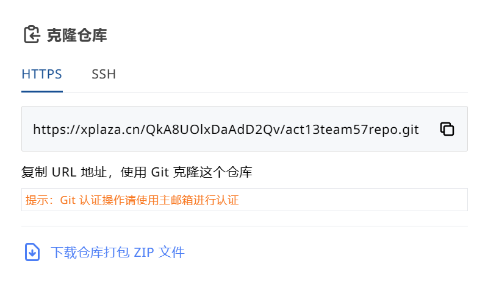

# db-searcher

## 仓库目录结构

```
.
├───ReadMe.md	仓库介绍文档
|
├───docs/		作品说明文档
|
├───release/	可执行文件目录
|
└───src/		源代码目录
```

# 用户手册

本文档主要服务于需要测试或使用搜索引擎功能的普通用户，内容包括搜索引擎图形化程序的安装、配置、使用教程。若需基于该项目的API接口进行程序开发，请阅读API接口文档。

## 一、$$Windows$$安装与配置教程

1. 克隆代码仓库，

   ```
   git clone https://xplaza.cn/QkA8UOlxDaAdD2Qv/act13team57repo.git
   ```

   或在$$XPlaza$$平台直接下载项目$$ZIP$$文件并解压，如图所示。

   <div>
   		<center>
        
        <br>
        图1-1 XPlaza平台下载ZIP文件
        </center>
   	</div>

2. 进入仓库`release\Windows\`目录下，其包含`DBSearch.zip`与`SearchEngineInstaller.exe`，分别对应项目所提供的两种软件安装方式。以下两种安装方式均自主建立运行时环境，无需本机配置环境。

   * 安装方式一：将`DBSearch.zip`解压至任意路径，运行其中`DBSearch.exe`即可。
   * 安装方式二：运行`SearchEngineInstaller.exe`，可以在其中选择`SearchEngine.exe`安装路径，并创建桌面快捷方式。通过该方式安装的软件功能受限，须进行配置。具体而言，**必须在安装路径下新建`index`与`text`文件夹**，分别用于存储索引与测试样例。

3. 运行`DBSearch.exe`后，出现界面如图1-2所示，则安装与配置已成功。

   <div>
   		<center>
        
        <br>
        图1-2 索引建立界面
        </center>
   	</div>

## 二、银河麒麟安装与配置教程

1. 下载仓库`release\Kylin\`目录下$$search.tar.gz$$压缩包，至银河麒麟平台`/usr/local/`目录下，使用如下命令进行解压，并进入解压后`search`目录：

   ```shell
   [root ... local]# tar zxvf search.tar.gz
   [root ... local]# cd search
   [root ... search]# ls
   demo	index	SearchEngine-1.0-SNAPSHOT.jar	text
   ```

2. 请首先配置`JDK17`环境。

3. 配置完成后，运行如下指令即可运行命令行$$demo$$。

   ```shell
   [root ... search]# chmod +x demo && ./demo
   ```

## 三、图形化界面使用教程

1. 运行程序出现如图1-2界面，此时应选择搜索区域以生成索引。程序提供了三种方式：

   * 读取历史记录：由于生成的索引通过序列化进行了保存，建立索引时可直接读取此前保存的索引。*可以减少索引建立的时间，但仅能读取**上一次**建立的索引，不能回溯此前被覆盖的索引。*
   * 读取`text`目录：以软件安装根目录下`text`文件夹作为搜索区域。*主要用于快速复现测试用例*。
   * 读取本地目录：以本地某目录作为搜索区域。*可以在文字框中输入目录绝对路径，也可以点击`浏览`进行目录选择*。

   选择生成方式与搜索区域后，点击`生成索引`，即可进入搜索界面，如图1-3所示。

   <div>
   		<center>
        
        <br>
        图1-3 搜索界面
        </center>
   	</div>

2. 搜索界面的最上方包含四个按钮与一个文字输入框，最下方包含六个按钮，其作用如下：

   * `退出`：退出搜索引擎程序。
   * `返回`：返回索引建立界面，可以重新选择生成方式与搜索区域。*此时选择读取历史记录即可继续执行原搜索过程*。
   * `搜索`：将文字输入框中的输入作为查询词，进行搜索，并将搜索结果展示在该界面表格中。
   * `设置`：设置搜索结果排序策略，支持按相关度、文件名、文件大小、最后修改时间排序，其中相关度即查询词出现次数。*设置完毕后需要重新进行搜索。*
   * `首页`：跳转到第一个搜索结果进行展示。*当程序已在展示第一个搜索结果时，点击该按钮会出现警告弹窗，提示非法请求。此后按钮出现警告弹窗的逻辑类似，不再赘述。*
   * `尾页`：跳转到最后一个搜索结果进行展示。
   * `上页`：跳转到上一个搜索结果进行展示。
   * `下页`：跳转到下一个搜索结果进行展示。
   * `上移`：展示内容预览部分的前256字符。
   * `下移`：展示内容预览部分的后256字符。

3. 查询词的格式必须遵循一定的规则，具体如下：

   * 单词、短语、布尔逻辑操作符之间必须有至少一个空格；
   * `NOT`操作符无法单独使用，即一个仅包含NOT操作符与短语的查询词是非法的；
   * `AND`与`OR`操作符无法相邻使用，即包含`... and or ...`或`... or and ...`的查询词是非法的。

4. 在搜索界面最上方文字输入框中输入满足格式规则的查询词后，点击`搜索`，即可进行搜索并展示搜索结果，如图1-4所示。此时可以点击最下方按钮切换展示文件与预览区域。

   <div>
   		<center>
        
        <br>
        图1-4 搜索结果展示
        </center>
   	</div>

5. 点击`退出`，即可退出搜索引擎程序。

## 四、命令行程序使用教程

1. 首次使用时，索引文件不存在，须指定搜索区域，输入$$ok$$（用于配置完毕的text目录进行测试）或某文件夹**绝对路径**即可开始建立索引。
2. 若索引文件已存在，须首先输入$$y$$或$$n$$选择是否更新索引：若更新索引，则重复步骤1；若不更新索引，则继续步骤3。
3. 索引建立后，提供索引二进制文件读取测试功能，输入$$y$$或$$n$$选择是否进行测试：若测试，则输出所读取索引的内容；若不测试，则继续步骤4。
4. 测试完毕后，可进行搜索，输入0即可退出搜索，输入查询词即可进行搜索并返回搜索结果，其中查询词的格式必须遵循一定的规则，具体如下：
   * 单词、短语、布尔逻辑操作符之间必须有至少一个空格；
   * 查询词不区分大小写；
   * `NOT`操作符无法单独使用，即一个仅包含NOT操作符与短语的查询词是非法的；
   * `AND`与`OR`操作符无法相邻使用，即包含`... and or ...`或`... or and ...`的查询词是非法的。
