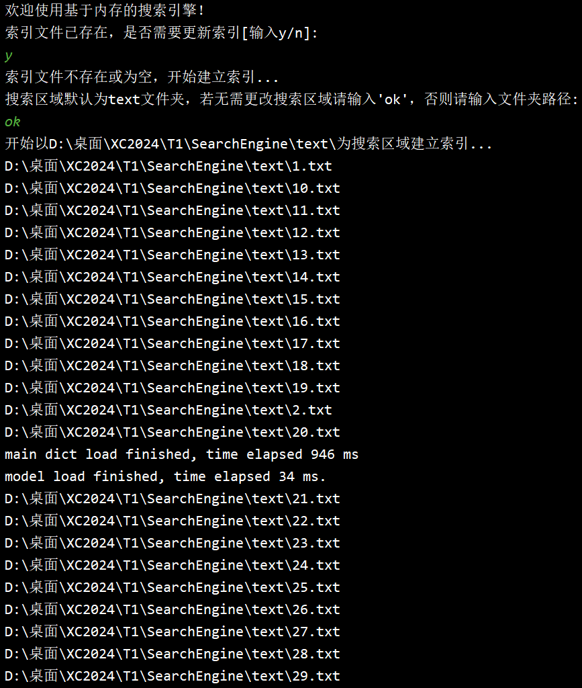
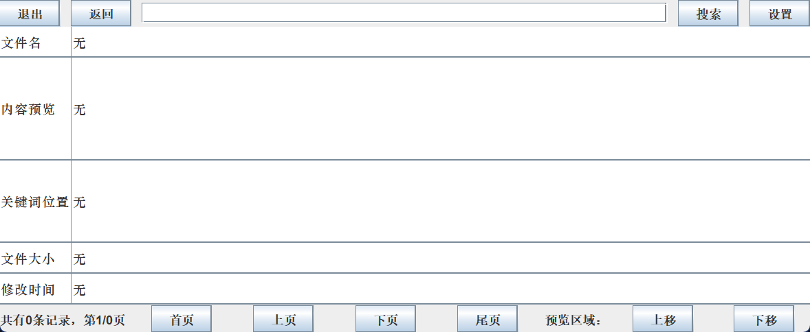
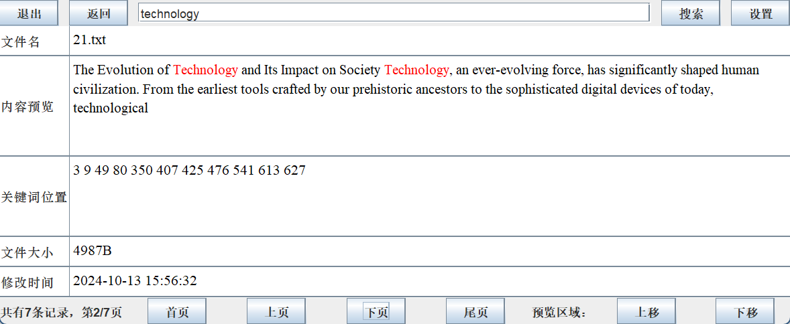

# 测试文档

本文档包含三部分内容，首先介绍功能测试与性能测试所用样例，再对搜索引擎的基础功能进行正确性测试，最后对搜索引擎在索引建立与搜索过程两方面的性能进行测试分析。

## 一、测试样例

本项目所使用测试样例为50个文本文档，存放在项目主目录的`text`目录下，命名均为`序号.txt`，其特征如下所示：

| 序号  | 语言 | 大小    | 题材与主题       |
| ----- | ---- | ------- | ---------------- |
| 1-15  | 英文 | 约0.5KB | 短片新闻评论     |
| 16-20 | 英文 | 约1.5KB | 科技相关中篇评论 |
| 21-25 | 英文 | 约5KB   | 科技相关长篇评论 |
| 26-35 | 英文 | 约0.3KB | 科技相关短片评论 |
| 36-40 | 中文 | 约5KB   | 长篇艺术评论     |
| 41-50 | 中文 | 约2KB   | 短篇科普文章     |

## 二、功能测试

**（一）索引建立**

1. 程序启动时界面如图2-1所示，此时可输入搜索区域，即目录名，也可选择输入`ok`使用默认目录`text`。

   

   		

        
         
        图2-1 命令行程序启动界面
        

   	

2. 输入`ok`后，程序开始建立倒排索引，并将所读取的文件与所建立的索引全部显示在控制台中，如图2-2至2-5所示。可以观察到程序能够读取文件夹text下的文本文档，再将文件内容拆分为单词并过滤，过短、过长、停用词、非字母单词均未出现在索引中，最后将索引显示在控制台中。

   

   		

        
         
        图2-2 所读取的文件部分预览
        

   	

   

   		

        
         
        图2-3 文件ID与路径映射关系部分预览
        

   	

   

   		

        
         
        图2-4 Posting List英文部分预览
        

   	

   

   		

        
         
        图2-5 Posting List中文部分预览
        

   	

3. 倒排索引建立完毕后，程序自动将索引序列化至`index.dat`，在搜索前会自动将索引反序列化至内存中。此时程序会进入测试反序列化的界面，可以输入`y`以观察序列化与反序列化效果，也可以输入`n`跳过测试，直接进行搜索。测试效果如图2-6所示，可以观察到输出的索引内容与此前建立的完全相同，说明序列化成功。

		

     
      
     图2-6 序列化与反序列化效果预览
     

	

**（二）搜索过程**

1. 反序列化测试完成或跳过后，进入搜索界面，如图2-7所示。输入格式已在用户手册中详细说明，用户可自行选择搜索方式，并严格按格式输入。

   

   		

        
         
        图2-7 搜索界面
        

   	

2. 输入`technology`进行英文单词搜索测试，结果如图2-8所示。可以观察到程序返回了多个Hit，并按分数由高到低依次显示；每个Hit显示其文件ID、文件绝对路径、分数、内容、检索词与Posting数据结构的映射关系，Posting中包含当前文件ID、检索词出现次数与位置列表。

  

  	

       
        
       图2-8 英文单词搜索结果预览
       

  

3. 输入`世界`进行中文单词搜索测试，结果如图2-9所示。

   

   	

        
         
        图2-9 中文单词搜索结果预览
        

   

4. 输入`世界 and 中国`进行AND搜索测试，结果如图2-10所示。可以观察到程序返回了多个Hit，并按分数由高到低依次显示，观察内容可知，AND搜索逻辑正确。

   

   	

        
         
        图2-10 AND搜索结果预览
        

   

5. 输入`coronavirus or technology`进行OR搜索测试，结果如图2-11所示。可以观察到程序返回了多个Hit，并按分数由高到低依次显示，观察内容可知，OR搜索逻辑正确。

   

   	

        
         
        图2-11 OR搜索结果预览
        

   

6. 输入`novel coronavirus`进行短语搜索测试，结果如图2-12所示。可以观察到程序只返回了一个Hit，其得分为1，显然，短语搜索的结果中应当将两个单词组成的短语作为整体，可知短语搜索逻辑正确。

   

   	

        
         
        图2-12 短语搜索结果预览
        

   

7. 输入`technology or 世界 and not 中国`进行NOT搜索测试，结果如图2-13所示。可以观察到程序返回的Hit中均不包含`中国`这一单词，可知NOT搜索逻辑正确。

   

   	

        
         
        图2-13 NOT搜索结果预览
        

   

**（三）图形化界面**

1. 图形化界面启动后如图2-14所示，三个选项分别用于直接载入索引二进制文件、以测试用例为搜索区域生成索引、选择其他目录为搜索区域生成索引，其中目录选择界面如图2-15所示。

   

   		

        
         
        图2-14 图形化界面
        

   	

   

   		

        
         
        图2-15 目录选择界面
        

   	

2. 选择索引生成方式以及可能需要的搜索区域后，点击`生成索引`，即可进入搜索界面，如图2-16所示。

   

   		

        
         
        图2-16 搜索界面
        

   	

   若选择其他目录为搜索区域但未指定目录，弹窗如图2-17所示；

   

   		

        
         
        图2-17 未指定目录弹窗
        

   	

   在搜索栏为空的情况下点击`搜索`，弹窗如图所示；

   

   		

        
         
        图2-18 搜索栏为空弹窗
        

   	

   在未显示搜索结果的情况下点击`首页`等按钮，弹窗如图2-19所示。

   

   		

        
         
        图2-19 无搜索结果弹窗
        

   	

3. 在搜索栏中输入`technology`，并点击`搜索`，排序后的搜索结果分页展示如下。

   

   		

        
         
        图2-20 单词搜索结果展示
        

   	

   可以观察到搜索结果的文件名、内容预览、关键词位置、文件大小、最后修改时间在该界面表格中依次展示，而在内容预览部分，搜索词作为关键词高亮显示在文本中。左下角记录条数表示本次搜索有7条结果，当前正在浏览第1条记录。

   此时点击`上页`或`首页`，弹窗如图所示；

   

   		

        
         
        图2-21 已到达首页弹窗
        

   	

   浏览第1条记录时，点击`下页`，界面变为展示第2条记录，如图2-22所示；

   

   		

        
         
        图2-22 分页功能展示1
        

   	

   浏览第2条记录时，点击`上页`，界面重新展示第1条记录；浏览第1条记录时，点击`尾页`，界面变为展示最后一条记录，即第7条，如图2-23所示；

   

   		

        
         
        图2-23 分页功能展示2
        

   	

   浏览最后一条记录时，点击`下页`或`尾页`，弹窗如图2-24所示；

   

   		

        
         
        图2-24 已到达尾页弹窗
        

   	

   浏览最后一条记录时，点击`首页`，界面重新展示第1条记录。

   此时点击`上移`，弹窗如图2-25所示；

   

   		

        
         
        图2-25 已到达文档开头弹窗
        

   	

   点击`下移`，内容预览区域展示下一段文字，如图所示；

   

   		

        
         
        图2-26 内容预览下移功能展示
        

   	

   直至展示最后一段文字时，点击`下移`，弹窗如图所示；

   

   		

        
         
        图2-27 已到达文档末尾弹窗
        

   	

   点击`上移`，内容预览区域展示上一段文字，如图所示。

   

   		

        
         
        图2-28 内容预览上移功能展示
        

   	

   在此过程中，关键词始终保持高亮。

4. 在搜索栏中输入`technology or 世界 and not 中国`，并点击`搜索`，排序后的搜索结果分页展示如下。

   

   		

        
         
        图2-29 混合搜索结果展示
        

   	

5. 点击`设置`，弹窗如图2-30所示，此时可以选择搜索结果的排序策略。

   

   		

        
         
        图2-30 排序策略选择弹窗
        

   	

   点击`文件名`，弹窗如图2-31所示。

   

   		

        
         
        图2-31 策略选择成功弹窗
        

   	

   再次点击`搜索`，可以观察到记录展示顺序发生改变，如图2-32所示。

   

   		

        
         
        图2-32 按文件名排序的搜索结果展示
        

   	

## 三、性能测试

对于性能测试，分别建立小规模数据与大规模数据，模拟不同数据规模下搜索引擎的运行，并分别测试索引建立、单词搜索、混合搜索三大功能运行用时。单词搜索以`technology`为搜索词，混合搜索以`technology or 世界 and not 中国`为搜索词。

我们将功能测试用例（text目录下50个文本文档）作为性能测试小规模用例；将小规模用例大量重复，生成10000个文本文档，作为大规模用例，置于many_text目录下。考虑到大规模用例内容含义较少、占用空间过大，并未上传至仓库。

性能测试结果如下，时间单位均为ms：

| 功能     | 小规模用例耗时 | 大规模用例耗时 |
| -------- | -------------- | -------------- |
| 索引建立 | 825            | 20775          |
| 单词搜索 | 21             | 214            |
| 混合搜索 | 16             | 452            |

由测试结果可知，搜索引擎在日常学习、工作适用的小规模用例上表现出色，索引的建立与搜索的进行十分迅速；而大规模用例上虽然索引建立耗时较长，但搜索的进行仍然迅速。考虑到索引的建立既可以通过序列化进行存储，以便复用，也可以在未来进行适当的优化，例如索引建立在后台进行，其耗时较长可以接受。

