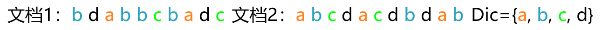
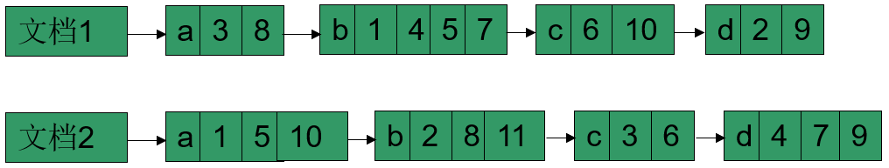
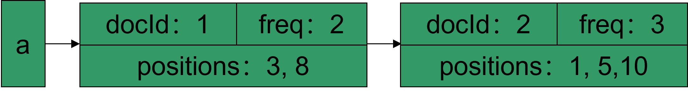
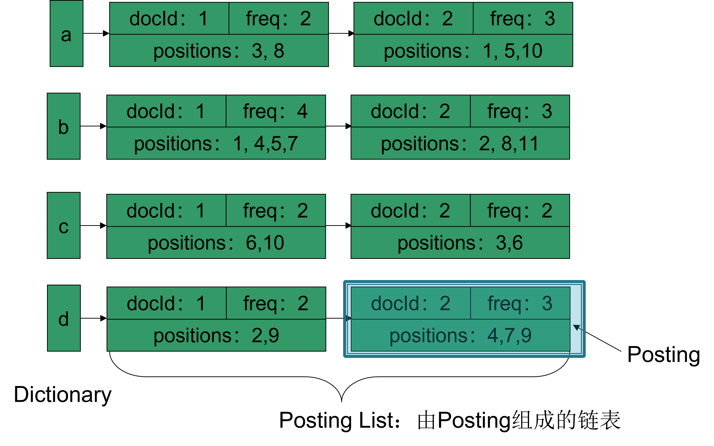
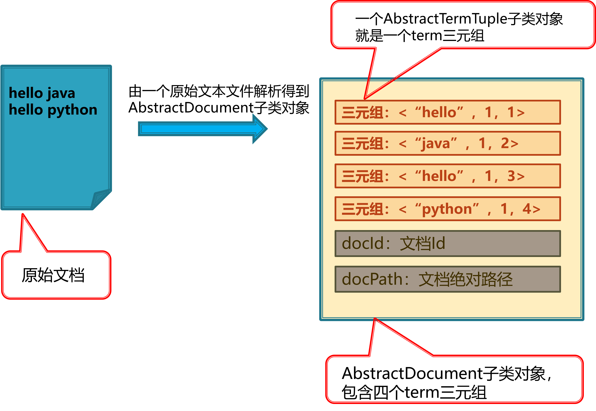
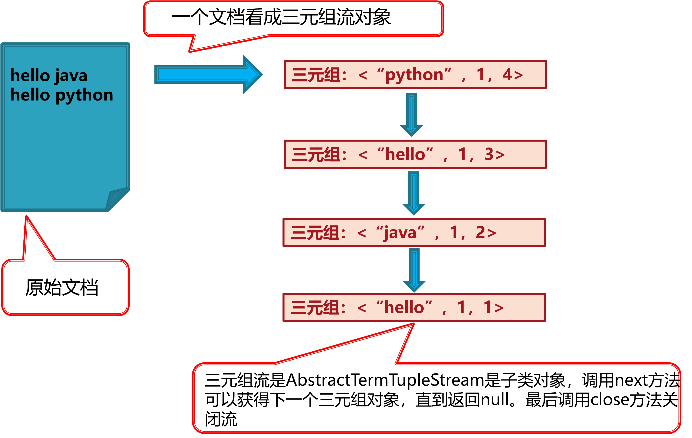
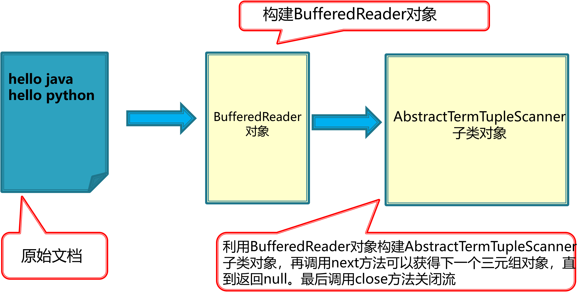

# 技术文档

本项目的核心算法为倒排索引机制，团队在充分理解倒排索引机制后，**完全自主**设计与实现了高效的倒排索引机制。团队共同设计了科学、灵活、可理解性强的项目框架、接口、抽象类，在使用`Java`语言予以实现的同时，巧妙地运用设计模式提高了代码的运行效率与可扩展性，并引用多项开源技术，对技术难点进行攻克，降低了开发难度。

本文档将主要从**倒排索引原理、倒排索引数据结构与算法的设计、设计模式与开源技术的运用**三方面进行技术总结。

## 一、倒排索引原理

该部分以倒排索引机制的设计思路为主线，由浅至深地阐述倒排索引原理。

1. term与分词

   在基于文本内容对文本文档进行搜索时，我们需要将处理后呈一定形式的文本内容与文件本身建立映射关系。无论是中文、英文还是其它语言的文本文档，其中的文本内容都由大量单词组成。在搜索引擎领域，人们称这些单词为**term**。而将一个文本文档切分为terms的过程，称为**分词**。

   为了将文本内容进行一定的分析与处理，对其进行分词是必不可少的过程。英文文档的分词较为简单，因为单词之间必定以空格或标点符号为分隔符；而中文文档的分词十分复杂，因为单词之间没有空格作为分隔符，并且一个短语通常有多种分词方法。对于英文文档，我们设计与实现了基于正则表达式的分词器，辅助进行分词，在此基础上，我们引用开源的**中文分词软件包`Jieba`**，以支持中文分词功能，在此不作赘述。

2. 分词结果后处理

   考虑到搜索过程基于中英文关键字，且用于搜索的查询词范围有限，我们为分词结果设计了一系列的**后处理步骤**，以降低存储消耗并提高搜索效率。其中较为典型的步骤包括：

   * 大小写转换，将terms全部以小写表示；
   * 过滤所有数字；
   * 过滤过短或过长的单词；
   * 过滤出现频率高但无意义、通常不作为查询词出现的单词，即**停用词**。

3. 字典

   对于文档集合$C$，在分词与后处理之后，对其中每个文档所对应的单词集合取并集，即可得到该文档集合的**字典**。形式化地，对于文档集合$C=\{d_1,d_2,...,d_n\}$，$C$包含n个文档，对文档$d_i(i=1,2,…,n)$进行分词与后处理得到的terms集合记为$Terms_i$，则文档集合$C$对应的字典$D_C$为每个文档分词得到的terms集合的并集，即：$D_C=Terms_1 \cup Terms_2 \cup … \cup Terms_n$。

4. 索引与前向索引机制

   **索引**是用于描述源文件信息组织的文件。获取字典后，可以将文档集合中的文件以一定的方式有序组织在一起。一种较为朴素的索引机制是**前向索引**，即将每篇文档表示为其序号与文本内容组成的向量模式。

   为方便描述，假设文档集合包含2个文档，分别为文档1与文档2。为简化问题，以字母代表文档中出现的term，则其内容与字典如图所示：

   <div>
   		<center>
        
        <br>
        图1-1 文档内容与字典示意图
        </center>
   	</div>

   则由该集合建立的前向索引如图所示：

   <div>
   		<center>
        
        <br>
        图1-2 前向索引示意图
        </center>
   	</div>

   由图可知，前向索引是**从文档到term**的链表结构，每个term后的数字表示该term在文档中出现的位置，如term c在文档2中出现在位置3与6。

   然而，前向索引在进行搜索时存在效率上的隐患。当用户输入查询词，如c时，程序需要扫描所有文档，即遍历所有文档链表，判断每个文档是否包含c。即使文档链表中term可以按字典序排序，从而在搜索时使用二分查找加快速度，但遍历所有文档链表的过程依然相当耗时，在文档数量巨大时基本难以运行。

   由上述分析可知，搜索过程的主要优化点在于减少文档的扫描。当用户输入查询词，若能直接定位到若干包含该查询词的文档，即可大幅提升搜索效率，而这种优化思路也顺势产生了另一种索引思想：**从term到文档**。

5. 倒排索引机制

   与前向索引相反，倒排索引是从term到文档的链表结构。依然以上文的文档集合为例，令docId为文档序号，即文档1、2的docId分别为1、2，则此时term a的倒排索引如图所示：

   <div>
   		<center>
        
        <br>
        图1-3 term a局部倒排索引示意图
        </center>
   	</div>

   该索引描述了以下信息：

   * term a在文档1（docId: 1）中出现，出现在位置3与8（positions: 3, 8）；
   * term a在文档2中出现，出现在位置1、5与10；
   * term a在文档1中出现了2次（freq: 2），在文档2中出现了3次。

   该文档集合完整的倒排索引如图所示：

   <div>
   		<center>
        
        <br>
        图1-4 倒排索引示意图
        </center>
   	</div>

   由图可知，倒排索引主要由两部分组成，即Dictionary与Posting List，前者中的term通常以字典序排序，以加快搜索速度，后者是由Posting组成的链表，而Posting是存储了每个term所出现的文档ID及其在文档中的出现位置与词频的结构。

   此时，当用户输入查询词c，程序将在Dictionary中定位c，假设字典包含N个按字典序排序的term，则定位过程时间复杂度为$O(log N)$。根据Heaps定理，若文本集合中具有M个term，则其包含的词汇量为$O(M^\beta)，\beta\in[0.4,0.6]$。对于英文，有实际意义的词汇量小于30万，故任意英文文档集合的字典大小小于30万个term，现代计算机完全可以在内存中实现字典的快速查找。定位c后，c所对应的Posting List即为搜索结果，显然，效率较前向索引大幅提升。

## 二、倒排索引数据结构

由图1-4可知，倒排索引可以由term、Posting、Posting List、Index四种数据结构组成。

其中，Posting List包含了多个Posting，Index包含了多个\<term, Posting List\>键值对，这些键值对维护了从单词到Posting List、从term到文档的链接关系。

上述四种数据结构的定义如下：

1. AbstractTerm：其具体子类实例为一个单词term
2. AbstractPosting：其具体子类实例为倒排索引里的一个Posting
   * 包含三个数据成员docId、freq、positions，分别代表单词出现的文档Id、出现频率、出现的位置列表
   * 位置列表采用Java的集合类型List\<Integer\>存贮单词出现的多个位置
3. AbstractPostingList：其具体子类实例为倒排索引里一个单词对应的PostingList
   * 包含一个List\<AbstractPosting\>类型的数据成员存放这个PostingList包含的多个Posting
4. AbstractIndex：其具体子类实例为内存中的整个倒排索引结构，包括两个数据成员：
   * docIdToDocPathMapping：类型为Map<Integer, String> ，保存了文档Id和文档绝对路径之间的映射关系（开始构建索引时我们只有每个文档的绝对路径，因此内部需要维护一个文档Id的计数器，每将一个文档加入到倒排索引，文档Id计数器加1）
   * termToPostingListMapping：类型为Map<AbstractTerm, AbstractPostingList> ，保存了每个单词与其对应的PostingList的映射关系。需要特别说明的是这里没有必要用专门的数据结构来存放字典内容，我们直接通过termToPostingListMapping.keySet( )方法就可以得到字典。

此外，为实现搜索引擎的索引序列化特性，上述四个抽象类必须实现FileSerializable接口，以实现将构建的索引序列化到文件，或从文件将构建的索引反序列化到内存。

构建索引前，需对集合内所有文本文档进行解析，为提高后续索引建立的效率，我们定义了两种中间数据结构，即term三元组与文档，用于辅助文档解析并保存其结果，其工作示意图与定义如下：

<div>
		<center>
	    
	    <br>
	    图1-5 中间数据结构工作示意图
	    </center>
	</div>

5. AbstractTermTuple：其具体子类实例为和单词term相关的三元组，包括三个数据成员：
   * AbstractTerm term：代表当前解析得到的一个term
   * final int freq = 1：因为解析得到了一个term，该term出现了一次，因此其频率为1
   * int curPos：该term的位置（注意位置序号是以term为单位不是以字符为单位）
6. AbstractDocument：其具体子类实例为解析完一个文档后文档在内存中的表示。解析完文档后，文档需要一种中间类型的数据结构表示，以方便后面倒排索引的建立。包括三个数据成员：
   * int docId：文档Id
   * String docPath：文档绝对路径
   * List\<AbstractTermTuple> tuples：文档解析完后得到的所有term的三元组

由于上述两个抽象类是中间数据结构，并不直接出现在索引中，故无需实现FileSerializable接口。

对于搜索命中结果，为支持其显示与排序，不能简单地以原始文本文档内容作为命中结果，我们定义了Hit这一数据结构，其定义如下：

7. AbstractHit：是搜索命中结果的抽象类。命中的文档必须要有特定的数据结构来支持命中结果的显示和排序，因此不能简单地用原始文本文档的内容作为命中结果。类里定义的数据成员有：
   * int docId：文档Id
   * String docPath：文档绝对路径
   * String content: 文档内容
   * double score = 1.0 : 命中结果得分，默认值为1.0，得分通过Sort接口计算
   * Map<AbstractTerm, AbstractPosting> termPostingMapping：命中的单词和对应的Posting键值对，对计算文档得分有用，对于一个查询命中结果（一个文档），一个term对应的是Posting而不是PostingList。

## 三、搜索引擎算法流程

**（一）索引建立**

1. 获取`Config`配置中的文本文档根目录，作为搜索区域。
2. 遍历搜索区域中的文件，通过后缀筛选出其中的文本文档，对每个文档进行分词与后处理，包括转小写、过滤数字、过滤过长或过短单词、过滤停用词，将处理后的每个term包装为term三元组，并由term三元组建立文档对象。
   * *在实现中，文档的读取、分词与后处理基于流访问，通过设计者模式实现了高扩展性，用户可自行添加更多的后处理方法，而仅需编写过滤器子类，该技术将在第四节中详细说明*

3. 遍历所有文档对象，对每个文档对象，先添加其文件Id与文件绝对路径之间的映射关系，再遍历其term三元组：若Index中已包含当前term，则根据当前文件信息与term出现信息构建Posting对象，加入当前term所对应的Posting列表；若Index中尚未包含当前term，则先建立值为当前term的键与其对应的Posting列表，同样构建Posting对象加入其中。

**（二）搜索过程**

1. 获取用户输入的查询字符串，假设格式正确。
2. 对查询字符串依次进行转小写、分词与合并处理：由于索引建立时term内容已转小写，查询词也须为小写；分词时以空白符为分界，得到包括所有查询单词与布尔逻辑操作符在内的字符串列表；合并时以布尔逻辑操作符为分界，将两个布尔逻辑操作符之间的所有单词合并为短语，进行短语搜索。
3. 对于单词、短语、`AND`、`OR`、`NOT`搜索，分别设计算法如下。
   * 单词搜索：假设搜索单词`c`，首先在Index的键集合中进行查找，若查找成功，获取其对应的Posting List，即可由此构建搜索命中结果$Hit_c$。
   * 短语搜索：由于索引并不直接存储短语，而是将其包含的单词分别存储，且我们已实现单词搜索，故为提高代码复用性，短语搜索将基于单词搜索实现。假设搜索短语`c d`，分别对c与d进行单词搜索，得到$Hit_c$与$Hit_d$，再遍历其Posting List，仅保留其中文件ID相同且出现位置相邻的Posting信息，并重新构建Posting与Posting List，由此构建$Hit_{c d}$，此即短语c d搜索命中结果。
   * `AND`搜索：假设搜索`c and d`，由于单词与短语搜索均已实现，无论c与d是单词或短语，均可以得到搜索结果hitc与hitd，再遍历其Posting List，仅保留其中文件ID相同的Posting信息，并重新构建Posting与Posting List，由此构建$Hit_{c\cap d}$，此即c and d搜索命中结果。
   * `OR`搜索：与AND搜索同理，区别在在遍历Posting List的过程中，需保留两个list的所有Posting信息，对于文件ID相同的Posting，需要对出现位置列表进行合并。
   * `NOT`搜索：作为一元操作符，单独出现在查询词中的`NOT`搜索无意义，必须与`AND`或`OR`搜索配合。假设查询词中出现`not c`，对`c`进行单词或短语搜索得到$Hit_c$，此时将$Hit_c$中命中得分置为无穷小，同时在输出搜索结果时过滤命中得分为负的结果，即可实现对`c`的屏蔽。

4. 单词、短语搜索与布尔逻辑操作符搜索的统一本质上与处理算术表达式相同，`AND`、`OR`搜索优先级最高，`NOT`搜索次之，单词、短语搜索优先级最低，基于此，总搜索算法将通过**栈**这一数据结构实现。具体而言，遍历处理后的查询字符串列表时，分别维护term栈与hit栈。若当前查询词为布尔逻辑操作符，由于查询字符串为中缀表达式，故只进行标记；若当前查询词为单词或词组，则进行搜索，并将term与hit入栈，若当前存在布尔逻辑操作符的标记，则将栈顶两个元素出栈，进行布尔操作后入栈。最终hit栈内剩余唯一元素，此即搜索结果。

## 四、设计模式与开源技术的运用

**（一）装饰者模式**

索引建立过程涉及文件访问，而`java.io`包中包含大量访问文件系统的API，并且均基于流访问。受此启发，由于本项目文件访问的基本单位是term三元组，我们设计了term三元组流，与`java.io`包中API通过设计模式中的**装饰者模式**相联系，实现从文件中直接读取与处理term三元组。流访问示意图与为此所设计的term三元组流抽象类如下：

<div>
		<center>
	    
	    <br>
	    图4-1 term三元组流访问示意图
	    </center>
	</div>

1. `AbstractTermTupleStream`：是另外二个抽象类的父类，是对解析文档过程中产生的一个个单词的三元组(`AbstractTermTuple`子类对象）的一个抽象，**即把一个文档看成三元组流**，其中规定了二个基于流的抽象方法：
   * `public abstract AbstractTermTuple next()`：从流中获得下一个三元组
   * `public abstract void close()`：关闭流

文件与`AbstractTermTupleStream`子类流对象通过`AbstractTermTupleScanner`类进行关联，该类定义如下：

2. `AbstractTermTupleScanner`：定义了如下数据成员和构造函数：
* `protected BufferedReader input` 
   
* `public AbstractTermTupleScanner(BufferedReader input)`

即`AbstractTermTupleScanner`通过`BufferedReader`与文件建立关联，即通过如下语句：

```java
BufferedReader reader = new BufferedReader(new InputStreamReader(new FileInputStream(new File(filePath))));
```

该语句即装饰者设计模式，文件路径通过层层装饰者传入`BufferedReader`。因此我们只要先构造好`BufferedReader`对象，再用该对象为参数去构造`AbstractTermTupleScanner`子类对象，再调用自己实现好的`next`方法就可以获取一个个三元组，其示意图如下：

<div>
		<center>
	    
	    <br>
	    图4-2 AbstractTermTupleScanner原理示意图
	    </center>
	</div>

通过`AbstractTermTupleScanner`子类对象获得三元组后，我们通过`AbstractTermTupleFilter`子类对象过滤不需要的三元组，该类定义如下：

3. `AbstractTermTupleFilter`：遵循装饰者模式所设计，为能够装饰`AbstractTermTupleScanner`子类，需要与其具有共同的抽象祖先类与覆盖实现的`next`方法
   * 数据成员：`AbstractTermTupleStream input`
   * 构造函数： `AbstractTermTupleFilter(AbstractTermTupleStream input)`

`AbstractTermTupleFilter`的构造函数参数指向被装饰的对象，数据成员`input`也就指向了被装饰的对象，构造函数产生的新对象和被装饰的对象都是`AbstractTermTupleStream`类型对象。

假设已经实现了`AbstractTermTupleScanner`的一个具体子类`SimpleScanner`，这个类必须实现了`next`方法，获取三元组流中的下一个三元组。假设也已经实现`AbstractTermTupleFilter`的一个具体子类`SimpleFilter`，这个类的`next`方法里应该首先调用`input.next()`方法获取被装饰对象的`next`方法返回的三元组；然后根据`SimpleFilter`的过滤规则判断这个三元组是否需要过滤：如果不需要过滤则从`next`直接返回这个三元组；如果需要过滤，则这个三元组跳过，继续调用`input.next()`方法获取被装饰对象的`next`方法返回的下一个三元组。

注意在装饰者的`next`方法里调用`input.next()`方法时，根据多态特性， `input.next()`一定会调用`input`所引用的被装饰对象的`next`方法。

更为重要的一点是，因为`AbstractTermTupleFilter`遵循装饰者模式，我们可以设计多种基于不同规则的过滤器子类，这些子类对象可以层层装饰，对三元组进行多规则过滤，但程序改动量极小，导致程序可扩展性极高。

二者组合使用的语句为：

```java
AbstractTermTupleStream scanner = new SimpleScanner(readrer);
AbstractTermTupleStream simpleFilter = new SimpleFilter(scanner);
AbstractTermTupleStream stopWordsFilter = new StopWordsFilter(scanner);

BufferedReader  reader = new BufferedReader(new InputStreamReader(new FileInputStream(new File(filePath))));
AbstractTermTupleStream ts = 
		new StopWordsFilter(new SimpleFilter (
			new SimpleScanner(readrer) ) );
```

**（二）中文分词**

本项目的一大技术难点为中文分词。与英文分词不同，中文分词更多地依靠语义，无空白符等记号辅助分词，属于NLP问题，而难以通过简单的正则表达式等手段完成。查阅资料后，我们发现目前已有大量支持中文分词的开源项目，例如Jieba、SnowNLP、PekSeg等。经对比分析，我们引用了Jieba的Java实现软件包，通过设计中文停用词表并调用其API，实现了中文文档的精准分词，为后续索引建立与搜索过程提供了基础，借助开源项目的力量巧妙攻克了该技术难点。